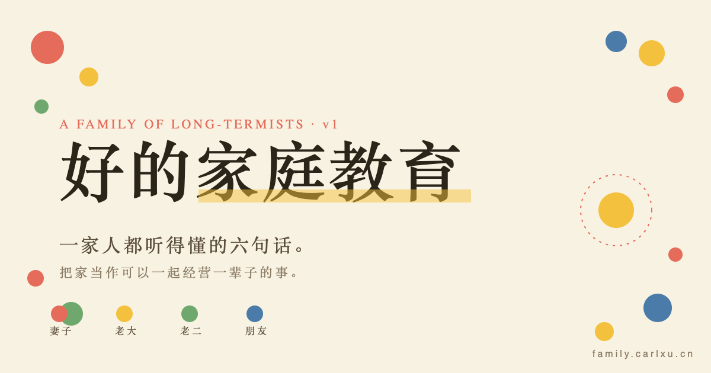

# 好的家庭教育 · 家庭操作系统

> A Family Operating System — 一家人都听得懂的六句话。把家当作可以一起经营一辈子的事。



## 这是什么？

这是一个**家庭教育的家庭版**——基于李笑来《好的家庭教育》《学习的真相》《专注的真相》等一系列内容，提炼成 6 条核心原则，并为家里**不同年龄、不同立场**的成员，做了 6 种不同的"打开方式"：

| 给谁 | 路径 | 形式 |
|---|---|---|
| 全家入口 | `/` | 家庭操作系统主页 |
| 妻子 | `/for-wife` | 5 分钟温和速览 |
| 12 岁哥哥 | `/for-eldest` | 5 题互动小测试 |
| 6 岁弟弟 | `/for-youngest` | 毛毛绘本系列 |
| 长辈朋友 | `/for-family-friends` | 三个真实小故事 |
| 周末饭后 | `/slides` | 14 页投屏幻灯片 |
| 贴墙 | `/wall` | A3 / A4 可打印海报（含 Tweaks 实时编辑） |

## 设计原则

- **不说教**：每条理念都先讲场景，再给一句操作
- **慢交付**：6 张卡片可以一周看一张，不用一次看完
- **可打印**：家庭墙海报支持 A3 / A4 直接打印贴墙
- **可编辑**：主版家庭墙含 Tweaks 面板，措辞可直接改并自动持久化
- **零构建**：纯静态 HTML + CSS + 少量原生 JS / React（CDN），不需任何 build

## 核心理念（六条）

1. 方向 比 目标 重要（发展论 vs 设计论）
2. 读书 是 家事（持续阅读）
3. 一起学，不教训（教是最好的学）
4. 软技能 也是 学问（学习的真相）
5. 保护 彼此的 注意力（专注的真相）
6. 不慌，时间是朋友（时间当作朋友）

## 部署

无需任何构建步骤。

### Vercel

1. Fork / clone 本仓库
2. Vercel → Import Project → 选这个仓库
3. Framework Preset: **Other**
4. Build Command / Output Directory 均**留空**
5. 部署完成；可在 Settings → Domains 绑定自定义域名

`vercel.json` 已配置 `cleanUrls: true`，所以访问 `/for-wife` 即可，无需 `.html` 后缀。

### 其它静态托管

直接把整个目录上传到 Cloudflare Pages / GitHub Pages / Netlify / 任意 CDN 都行。

## 本地预览

```bash
# 任意一个静态服务器都行
npx serve .
# 或
python3 -m http.server 8000
```

## 字体

使用 [LXGW WenKai TC](https://github.com/lxgw/LxgwWenKai)（霞鹜文楷），免费开源中文字体，通过 Google Fonts CDN 加载。

## 致谢

- 内容理念：李笑来《好的家庭教育》系列
- 字体：lxgw / 霞鹜文楷
- 视觉：受日式绘本和长期主义海报启发

## License

内容采用 [CC BY-NC-SA 4.0](https://creativecommons.org/licenses/by-nc-sa/4.0/)——非商业、署名、相同方式分享。
代码部分 MIT。

---

*v1 · 持续升级 · "先从我开始，然后是我们，最后是这个家。"*
